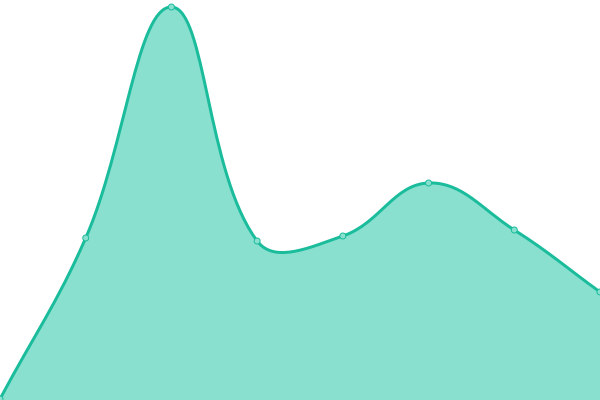
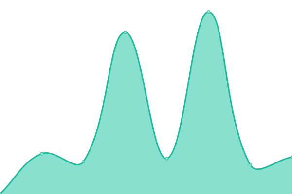

# [📈 Live Status](https://status2.grigora.co): <!--live status--> **🟩 All systems operational**

This repository contains the open-source uptime monitor and status page for [Latracal Solutions](https://latracal.com/), powered by [Upptime](https://github.com/upptime/upptime).

With [Upptime](https://upptime.js.org), you can get your own unlimited and free uptime monitor and status page, powered entirely by a GitHub repository. We use [Issues](https://github.com/latracal/status.grigora.co/issues) as incident reports, [Actions](https://github.com/latracal/status.grigora.co/actions) as uptime monitors, and [Pages](https://status2.grigora.co) for the status page.

<!--start: status pages-->
<!-- This summary is generated by Upptime (https://github.com/upptime/upptime) -->
<!-- Do not edit this manually, your changes will be overwritten -->
<!-- prettier-ignore -->
| URL | Status | History | Response Time | Uptime |
| --- | ------ | ------- | ------------- | ------ |
|  [Dashboard](https://build.grigora.co) | 🟩 Up | [dashboard.yml](https://github.com/latracal/status.grigora.co/commits/HEAD/history/dashboard.yml) | 

 1011ms
     
 | 

<a href="https://status.grigora.co/history/dashboard">100.00%</a>
    

|  [API](https://api.grigora.co) | 🟩 Up | [api.yml](https://github.com/latracal/status.grigora.co/commits/HEAD/history/api.yml) | 

 3286ms
     
 | 

<a href="https://status.grigora.co/history/api">100.00%</a>
    

|  [Hosted Websites](https://test.grigora.app) | 🟩 Up | [hosted-websites.yml](https://github.com/latracal/status.grigora.co/commits/HEAD/history/hosted-websites.yml) | 

 1923ms
     
 | 

<a href="https://status.grigora.co/history/hosted-websites">100.00%</a>
    

|  [CDN](https://cdn.grigora.co) | 🟩 Up | [cdn.yml](https://github.com/latracal/status.grigora.co/commits/HEAD/history/cdn.yml) | 

 959ms
     
 | 

<a href="https://status.grigora.co/history/cdn">100.00%</a>
    

|  [Support System](https://support.grigora.co) | 🟩 Up | [support-system.yml](https://github.com/latracal/status.grigora.co/commits/HEAD/history/support-system.yml) | 

 2157ms
     
 | 

<a href="https://status.grigora.co/history/support-system">100.00%</a>
    

<!--end: status pages-->

[**Visit our status website →**](https://status2.grigora.co)

## 📄 License

- Powered by: [Upptime](https://github.com/upptime/upptime)
- Code: [MIT](./LICENSE) © [Anand Chowdhary](https://anandchowdhary.com), supported by [Pabio](https://pabio.com)
- Data in the `./history` directory: [Open Database License](https://opendatacommons.org/licenses/odbl/1-0/)
